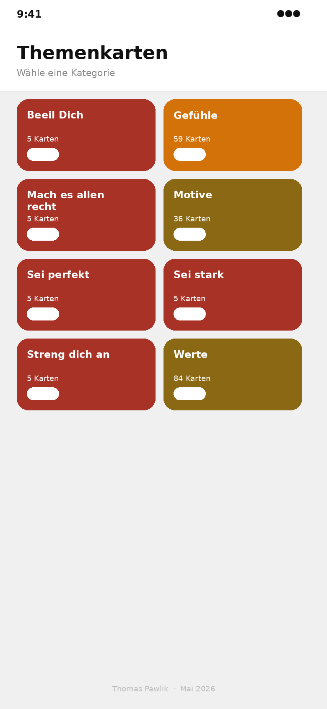
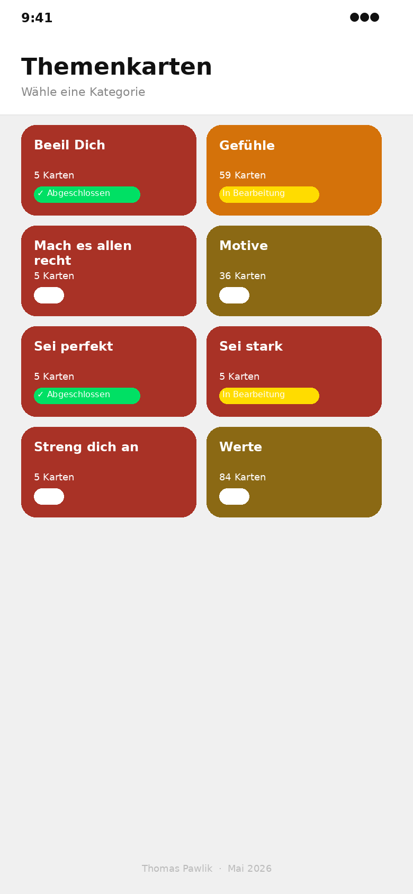
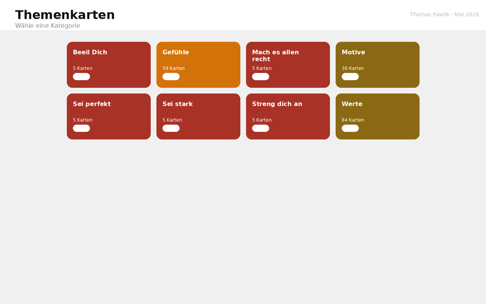
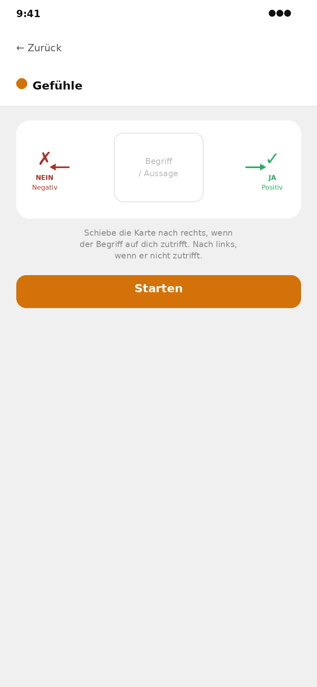
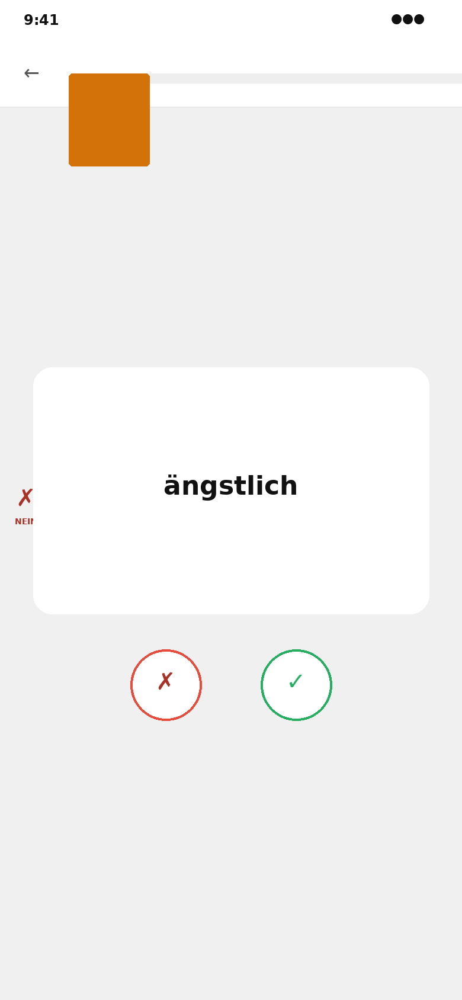
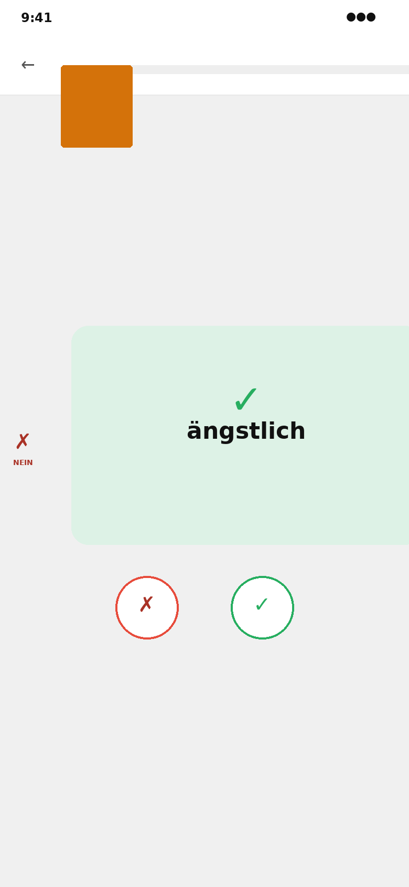
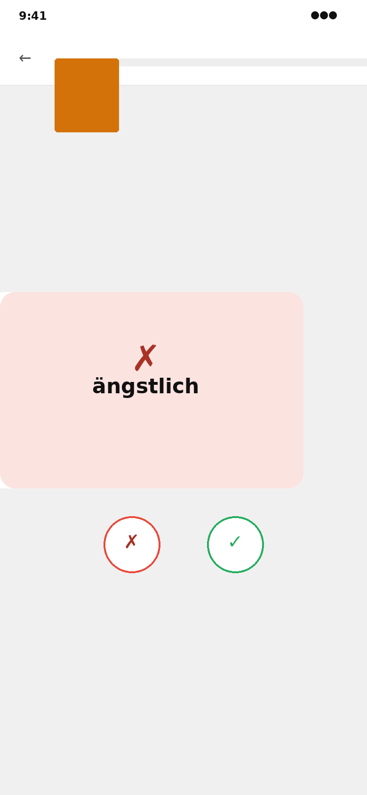
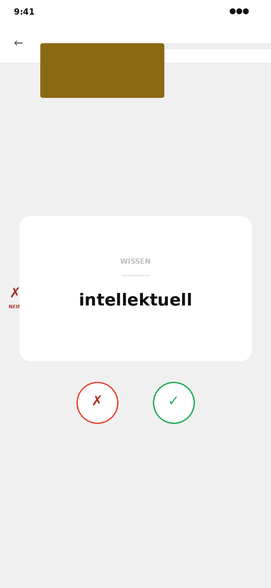
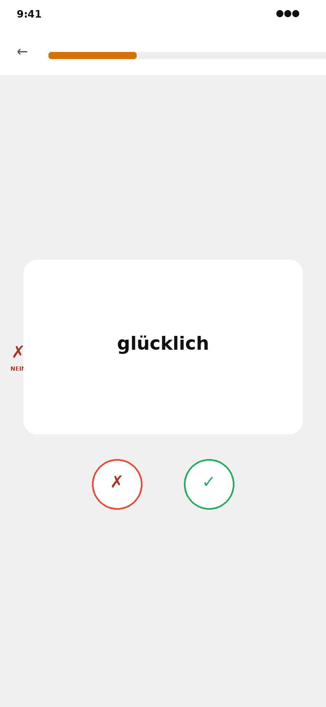
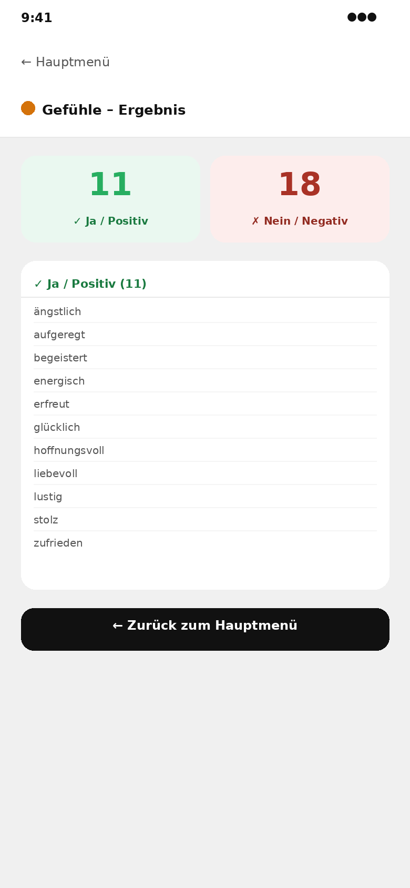

# Themenkarten-App

Eine interaktive, mobile-optimierte Web-App zum Durcharbeiten von Themenkarten per Swipe-Geste – ohne Installation, direkt im Browser.

**Erstellt von:** Thomas Pawlik &nbsp;·&nbsp; Mai 2026

---

## Inhaltsverzeichnis

- [Überblick](#überblick)
- [Features](#features)
- [Screenshots](#screenshots)
- [Kategorien & Inhalte](#kategorien--inhalte)
- [Bedienung](#bedienung)
- [Technische Details](#technische-details)
- [Installation & Nutzung](#installation--nutzung)

---

## Überblick

Die Themenkarten-App digitalisiert physische Karteikarten aus Trainings- und Coaching-Kontexten. Der Nutzer swipet Karten nach **rechts (Ja/Positiv)** oder **links (Nein/Negativ)** und erhält am Ende eine sortierte Auswertung. Der Fortschritt wird automatisch gespeichert.

---

## Features

| Feature | Beschreibung |
|---|---|
| 🃏 **Swipe-Mechanik** | Touch & Mouse – Karte folgt dem Finger mit Rotation |
| 📱 **Responsives Design** | Optimiert für iPhone, iPad und Desktop |
| 💾 **Automatische Speicherung** | Fortschritt & Auswahl per localStorage |
| 🔄 **Fortsetzen / Neu starten** | Abgebrochene Sessions werden wiederhergestellt |
| 📊 **Ergebnisauswertung** | Grüner & roter Stapel, scrollbare Detailliste |
| 🎨 **8 Kategorien** | Farbcodiert, je mit Status-Badge |
| ✅ **Keine Installation** | Einzelne HTML-Datei, läuft im Browser |

---

## Screenshots

### Hauptmenü

Das Hauptmenü zeigt alle 8 Kategorien als farbige Kacheln. Jede Kachel zeigt den **Status-Badge**: *Neu*, *In Bearbeitung* oder *Abgeschlossen ✓*.

| Frisch gestartet | Mit Status-Badges |
|:---:|:---:|
|  |  |

---

### Desktop-Ansicht

Auf dem Desktop werden die Kategorien in einem 4-spaltigen Grid dargestellt.



---

### Kategorie-Start

Nach Auswahl einer Kategorie erscheint ein **Erklär-Screen** mit einer animierten Grafik, die die Swipe-Richtungen zeigt. Je nach Status erscheinen unterschiedliche Buttons.



---

### Swipe-Screen

Der Kern der App: Karten werden per Wischgeste oder Button-Klick bewertet.

| Karte neutral | Swipe nach rechts (Ja ✓) | Swipe nach links (Nein ✗) |
|:---:|:---:|:---:|
|  |  |  |

**Swipe-Verhalten:**
- Karte folgt dem Finger/Maus mit leichter Rotation
- Ab **80 px** Schwellenwert fliegt die Karte heraus
- Darunter federt sie zur Mitte zurück
- Grüner / roter Overlay mit Icon blendet proportional ein

---

### Motive-Karten (Sonderformat)

Die Kategorie *Motive* zeigt Karten mit **Oberbegriff** (klein, uppercase) und **Unterbegriff** (groß, hervorgehoben).



---

### Fortschrittsbalken

Der Fortschrittsbalken oben zeigt den aktuellen Stand. Beim Verlassen der App wird der Index gespeichert und beim Wiedereinstieg fortgesetzt.



---

### Ergebnisanzeige

Nach Abschluss einer Kategorie werden die Karten in **grünen (Ja)** und **roten (Nein)** Stapel aufgeteilt. Per Klick auf einen Stapel öffnet sich eine scrollbare Liste aller Begriffe.



---

## Kategorien & Inhalte

| Kategorie | Farbe | Karten | Kartentyp |
|---|---|---|---|
| **Beeil Dich** | Dunkelrot | 5 | Aussagesätze |
| **Gefühle** | Orange | 59 | Einzelbegriffe |
| **Mach es allen recht** | Dunkelrot | 5 | Aussagesätze |
| **Motive** | Gold | 36 | Oberbegriff / Unterbegriff |
| **Sei perfekt** | Dunkelrot | 5 | Aussagesätze |
| **Sei stark** | Dunkelrot | 5 | Aussagesätze |
| **Streng dich an** | Dunkelrot | 5 | Aussagesätze |
| **Werte** | Gold | 84 | Einzelbegriffe |

**Gesamt: 204 Karten**

---

## Bedienung

### Mobile (Touch)
1. Kategorie antippen → Erklär-Screen → **Starten**
2. Karte nach **rechts** wischen = Ja ✓
3. Karte nach **links** wischen = Nein ✗
4. Nach allen Karten: Ergebnis-Screen öffnet sich automatisch

### Desktop (Maus)
- Karte per **Klick & Drag** verschieben, oder
- **✗ / ✓ Buttons** unterhalb der Karte nutzen

### Navigation
- **Zurück-Button** → jederzeit zum Hauptmenü (Fortschritt bleibt erhalten)
- Abgeschlossene Kategorie → **„Ergebnis anzeigen"** oder **„Neu starten"**

---

## Technische Details

```
Technologie:    Vanilla HTML + CSS + JavaScript (keine Abhängigkeiten)
Dateistruktur:  Single File (themenkarten-app.html)
Datenspeicher:  localStorage (pro Kategorie)
Swipe-Logik:    Native Touch/Mouse Events, 80px Threshold
Animationen:    CSS transforms + transitions
Responsive:     Mobile-first, Breakpoints bei 480/768/900px
Kompatibilität: iOS Safari, Android Chrome, Desktop Chrome/Firefox/Safari/Edge
```

### Gespeicherte Daten (pro Kategorie)

```json
{
  "green": ["Begriff1", "Begriff2"],
  "red":   ["Begriff3"],
  "idx":   3,
  "status": "progress"
}
```

`status` kann sein: `new` | `progress` | `done`

---

## Installation & Nutzung

### Option 1 – Lokal
```bash
# Datei herunterladen und direkt im Browser öffnen
open themenkarten-app.html
```

### Option 2 – GitHub Pages
```bash
git clone https://github.com/dein-username/themenkarten
cd themenkarten
# index.html = themenkarten-app.html
# GitHub Pages aktivieren → fertig
```

### Option 3 – Webserver
```bash
python3 -m http.server 8080
# → http://localhost:8080/themenkarten-app.html
```

> **Hinweis:** Die App benötigt keinen Server – sie funktioniert vollständig als lokale HTML-Datei.

---

*Thomas Pawlik · Mai 2026*
